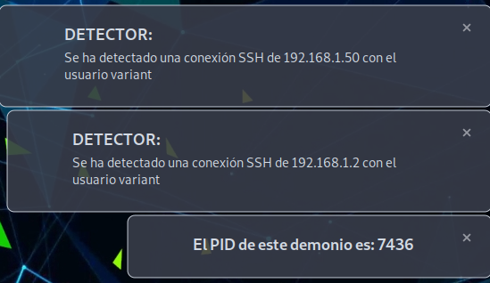

# SSH_Neutralizador-Detector

# ¿Cómo funciona?

1.- Se activa el script.
sudo bash Neutralizador_SSH.sh || sudo Detector_SSH.sh

2.- Esperar a que haya una conexión SSH y se mostrará por pantalla (no terminal).

# Explicación
1. Cuando el script se ejecute por primera vez, aparecerá por pantalla el número PID del proceso. Por si se ejecuta el segundo plano poder matarlo.

2.- Cuando detecte una conexión mediante SSH solamente se mostrará al usuario con interfaz gráfica que ha ejecutado el script, indicando que hay una conexión SSH identificado como usuario X y como IP Z.
2.1.- Si es el Neutralizador el script ejecutado solamente se mostrará por pantalla aquellos usuarios que no es posible echarlos (falta de permisos o algún otro error). Si lo expulsa correctamente no mostrará ningún mensaje.

